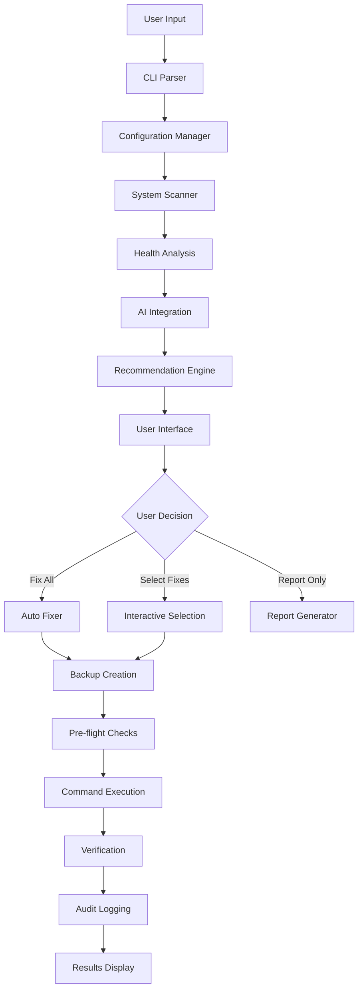

# Asahi System Healer

<p align="center">
  
</p>

<p align="center">
  <strong>An advanced, AI-powered system health management tool specifically designed for Asahi Linux on Apple Silicon Macs.</strong>
</p>

<p align="center">
  
  <br>
  <em>Built for the Asahi Linux Community</em>
</p>

[](https://opensource.org/licenses/MIT)
[](https://www.python.org/downloads/)
[](https://asahilinux.org/)
[](https://github.com/your-repo/asahi-health-manager)

## Features

### Intelligent Application Management (NEW!)
- **Curated App Database**: Hand-picked applications optimized for Asahi Linux
- **Category Browsing**: Browse apps by Development, Productivity, Multimedia, Gaming, and more
- **Smart Recommendations**: AI-powered app suggestions based on popularity and compatibility
- **One-Click Installation**: Easy installation with automatic dependency management
- **Asahi Compatibility Notes**: Performance tips and compatibility information for Apple Silicon
- **Quick Essentials Setup**: Install essential apps with a single command
- **Desktop Integration**: Pin to taskbar/dock with professional app launcher

### Comprehensive Theme Management (NEW!)
- **Desktop Environment Detection**: Automatically detects KDE, GNOME, XFCE, etc.
- **40+ Curated Themes**: GTK themes, icon packs, cursors, wallpapers, and fonts
- **Theme Presets**: Complete style makeovers (Modern Dark, Material Design, etc.)
- **Compatibility Filtering**: Only shows themes that work with your desktop environment
- **Font Management**: Coding fonts (Fira Code, JetBrains Mono) and UI fonts
- **One-Click Installation**: Automatic theme application with post-install configuration

### Comprehensive System Scanning
- **OS Health Analysis**: Memory, disk, kernel, and boot health monitoring
- **Hardware Status**: Thermal monitoring, power management, display issues
- **Network Diagnostics**: WiFi, connectivity, and interface health
- **Application & Configuration Auditing**: Installed packages, configurations
- **Log Analysis**: System logs, error detection, and pattern recognition
- **Asahi-Specific Checks**: 16K page size issues, m1n1 bootloader, Apple Silicon compatibility

### AI-Powered Analysis
- **Claude Integration**: Advanced system analysis using Anthropic's Claude
- **OpenAI Support**: ChatGPT integration for recommendations
- **Real-time Solutions**: Up-to-date fixes from community knowledge (2025)
- **Contextual Recommendations**: AI understands Asahi Linux specifics
- **Risk Assessment**: AI evaluates fix safety and impact
- **Multi-Provider Fallback**: Automatic switching between AI services

### Automated Repair System
- **Smart Fixing**: Automated resolution of detected issues
- **Safety First**: Comprehensive pre-flight checks and backups
- **User Control**: Choose individual fixes or fix all
- **Rollback Support**: Easy restoration from automatic backups
- **Risk Categorization**: Critical, high, medium, low severity fixes
- **Dry-Run Mode**: Preview changes without executing them

### Intelligent Scheduling
- **Flexible Scheduling**: Cron-based task scheduling
- **Automated Maintenance**: Regular health checks and fixes
- **Background Operation**: Daemon mode for continuous monitoring
- **Custom Schedules**: Hourly, daily, weekly, or custom intervals
- **Systemd Integration**: Full service management

### Rich Terminal Interface
- **Beautiful UI**: Rich terminal interface with progress bars and tables
- **Interactive Menus**: Easy navigation and selection
- **Detailed Reports**: Comprehensive system health reports
- **Export Capabilities**: JSON, HTML, and markdown report formats
- **Real-time Progress**: Live updates during scans and fixes

### Advanced Reporting
- **Executive Summaries**: High-level system health overview
- **Detailed Analysis**: In-depth findings and recommendations
- **Trend Analysis**: Historical data and performance trends
- **Audit Logging**: Complete action history and security events
- **Performance Metrics**: System resource usage tracking

## Quick Start

### Prerequisites

- **Asahi Linux** (Fedora Remix 39+ or Arch Linux ARM)
- **Python 3.9+** (3.10+ recommended)
- **sudo access** for system modifications
- **Internet connection** for AI features (optional)

### One-Line Installation

```bash
curl -fsSL https://raw.githubusercontent.com/your-repo/asahi-health-manager/main/install.sh | bash
```

### Manual Installation

1. **Clone the repository:**
   ```bash
   git clone https://github.com/your-repo/asahi-ai-system-manager.git
   cd asahi-ai-system-manager
   ```

2. **Run the installer:**
   ```bash
   chmod +x install.sh
   ./install.sh
   ```

3. **Or install manually:**
   ```bash
   pip3 install -r requirements.txt
   chmod +x asahi_healer.py
   python3 asahi_healer.py --setup
   ```

### Quick Test

```bash
# Run a basic system scan
asahi-healer --scan

# Launch the Application Manager (NEW!)
asahi-healer --apps

# Install desktop integration for easy access (NEW!)
./install-desktop-integration.sh

# Check what fixes would be applied (safe)
asahi-healer --dry-run --fix-all

# View help and all options
asahi-healer --help
```

## Complete Command Reference

```bash
asahi-healer [OPTIONS]

System Scanning:
  --scan              Run full system scan (default)
  --quick-scan        Run quick health check
  --deep-scan         Run comprehensive deep scan

Application Management:
  --apps              Launch intelligent app manager (NEW!)

Fixing & Maintenance:
  --fix-all           Auto-fix all detected issues
  --fix-critical      Fix only critical issues
  --fix-selected      Interactively select fixes to apply
  --dry-run          Preview changes without executing
  --rollback PATH     Rollback from backup

Scheduling & Automation:
  --daemon            Run in daemon mode
  --schedule FREQ     Setup schedule (hourly|daily|weekly|monthly)
  --scheduled-task ID Run specific scheduled task
  --list-schedules    Show all scheduled tasks

Reporting & Analysis:
  --report-only       Generate report without fixes
  --export-report PATH Export detailed report
  --show-logs         Display recent activity logs
  --system-info       Show detailed system information

Configuration:
  --setup             Run interactive setup wizard
  --config PATH       Use specific configuration file
  --validate-config   Check configuration validity
  --reset-config      Reset to default configuration

Advanced Options:
  --verbose           Enable verbose output
  --debug             Enable debug logging
  --no-backup         Skip backup creation (dangerous)
  --force             Force execution without confirmations
  --ai-provider NAME  Use specific AI provider (claude|openai)
```

## Application Manager

The new Intelligent Application Manager provides a curated selection of applications optimized for Asahi Linux on Apple Silicon Macs.

### Features

- **30+ Curated Applications**: Hand-picked apps tested on Asahi Linux
- **10 Categories**: Development, Productivity, Multimedia, Gaming, Communication, System Tools, Graphics, Network, Education, Utilities
- **Smart Recommendations**: Apps ranked by popularity and compatibility
- **Asahi-Specific Notes**: Performance tips for Apple Silicon (e.g., Rust via rustup for 16K page compatibility)
- **Multiple Package Managers**: Supports DNF, Flatpak, and source installations
- **Batch Installation**: Install multiple apps at once

### Usage

```bash
# Launch the Application Manager
asahi-healer --apps
```

#### Main Menu Options:
1. **Browse by Category**: Explore apps organized by type
2. **View Top Recommendations**: See the most popular uninstalled apps
3. **Search Applications**: Find apps by name or description
4. **View Installed Apps**: See what's already installed
5. **Quick Install Essentials**: One-click installation of must-have apps
6. **Export Recommendations**: Save app list to JSON file

### Essential Applications Included

**Development Tools:**
- Visual Studio Code, Neovim, Git, Docker, Rust (16K compatible), Node.js, Python Pip

**Productivity:**
- Firefox, Chromium, Thunderbird, LibreOffice, Obsidian

**Multimedia:**
- VLC, MPV, Spotify, Audacity

**Graphics & Design:**
- GIMP, Inkscape, Krita, Blender (with GPU acceleration)

**Communication:**
- Discord, Slack, Signal

**System Tools:**
- **Asahi Audio** (CRITICAL - Essential audio configuration for Apple Silicon)
- htop, Neofetch, Timeshift, GParted

**Gaming & Windows Compatibility:**
- Steam (Experimental x86 emulation support)
- Native ARM64 games (SuperTuxKart, Minetest)
- Wine (Windows compatibility layer)
- Bottles (Modern Wine management)
- Lutris (Gaming platform with Wine integration)
- Box64 (x86 emulation for ARM64)

**Themes & Customization:**
- **Theme Manager** (Comprehensive desktop theming system)

## Theme Manager

The integrated Theme Manager provides professional desktop customization with curated themes optimized for Asahi Linux.

### Features

- **Desktop Environment Detection**: Automatically detects your DE (KDE, GNOME, XFCE, etc.)
- **40+ Curated Themes**: Professional themes tested on Asahi Linux
- **8 Theme Categories**: GTK themes, icon packs, cursors, wallpapers, fonts, Plasma themes, shell extensions
- **Compatibility Filtering**: Only shows themes compatible with your desktop environment
- **Theme Presets**: Complete style collections for instant makeovers

### Usage

#### Access Theme Manager:
```bash
# Method 1: Through App Manager
asahi-healer --apps
# → Browse by Category → Themes & Customization → Theme Manager

# Method 2: Direct launch (after desktop integration)
# Search for "Asahi App Manager" → Right-click → Theme Manager
```

### Theme Categories

#### **GTK Themes** (Window Appearance)
- **Arc Theme**: Modern flat theme with transparency
- **Nordic**: Dark Scandinavian theme (Nord colors)
- **Orchis**: Material Design with multiple variants
- **Adapta**: Material Design inspired adaptive theme
- **Materia**: Clean Material Design for GTK3/4

#### **Icon Packs** (Application Icons)
- **Papirus**: Most popular SVG icon theme (10/10 rating)
- **Tela**: Flat colorful design icons
- **Fluent**: Microsoft Fluent Design inspired
- **Candy**: Sweet gradient icons
- **La Capitaine**: macOS and Material Design inspired

#### **Cursor Themes** (Mouse Appearance)
- **Bibata**: Material Based cursor theme
- **Capitaine**: macOS-inspired cursors
- **Oreo**: Animated cursors with smooth transitions

#### **Font Collections**
**Coding Fonts:**
- **Fira Code**: Programming ligatures (10/10 rating)
- **JetBrains Mono**: Developer-focused design
- **Cascadia Code**: Microsoft's modern coding font

**UI Fonts:**
- **Inter**: Modern UI font for screens
- **Noto**: Google's comprehensive language support

#### **Wallpaper Collections**
- **Dynamic Wallpapers**: Time-based changing backgrounds
- **Nordic**: Minimalist matching Nordic color scheme
- **Firewatch**: Beautiful landscape wallpapers
- **Abstract**: Modern geometric designs

### Theme Presets

#### **Modern Dark**
- Nordic theme + Papirus icons + Bibata cursors + Fira Code font
- Perfect for developers and dark theme lovers

#### **Material Design**
- Adapta theme + Tela icons + Capitaine cursors + JetBrains Mono
- Google Material Design aesthetic

#### **Minimal Light**
- Arc theme + La Capitaine icons + Inter font + Nordic wallpapers
- Clean and professional light theme

#### **Developer Setup**
- Nordic theme + all coding fonts + development-optimized configuration
- Complete setup for programming

#### **KDE Candy** (KDE Only)
- Sweet theme + Candy icons + Oreo cursors + colorful wallpapers
- Fun and colorful for KDE Plasma users

### Desktop Integration

```bash
# Install desktop application launcher
./install-desktop-integration.sh
```

**After installation, you can:**
- **Find "Asahi App Manager" in your applications menu**
- **Pin to taskbar/dock** for one-click access
- **Right-click for quick actions**: App Manager, Theme Manager, System Scan
- **Search by typing "Asahi"** in your app launcher

**Desktop Environment Support:**
- **KDE Plasma**: Application Menu → System → Asahi App Manager
- **GNOME**: Activities → Show Applications → Asahi App Manager
- **XFCE**: Applications Menu → System → Asahi App Manager
- **MATE**: Applications Menu → System Tools → Asahi App Manager

## Configuration

### AI API Keys Setup

The system supports multiple ways to configure AI API keys:

```bash
# Method 1: Environment Variables (Recommended)
export CLAUDE_API_KEY="sk-ant-api03-..."
export OPENAI_API_KEY="sk-proj-..."

# Method 2: Configuration File
asahi-healer --setup

# Method 3: Direct file edit
nano ~/.config/asahi_healer/config.yaml
```

### Complete Configuration Reference

```yaml
# ~/.config/asahi_healer/config.yaml

api:
  claude_api_key: "your-claude-key"
  openai_api_key: "your-openai-key"
  claude_model: "claude-3-sonnet-20240229"
  openai_model: "gpt-4-turbo-preview"
  max_tokens: 4000
  timeout: 60
  preferred_provider: "claude"  # claude|openai|auto

scanning:
  enable_deep_scan: true
  scan_timeout: 300
  parallel_scans: true
  include_logs: true
  include_hardware: true
  include_network: true
  asahi_specific_checks: true
  max_log_lines: 1000

fixing:
  auto_fix_enabled: false
  auto_fix_severity_limit: "low"  # low|medium|high|critical
  create_backups: true
  backup_retention_days: 30
  dry_run_by_default: true
  require_confirmation_high_risk: true
  max_concurrent_fixes: 1

reporting:
  generate_detailed_reports: true
  report_format: "json"  # json|html|markdown
  keep_report_history: 10
  include_system_snapshot: true
  anonymize_sensitive_data: true

notifications:
  enabled: false
  critical_only: true
  email_enabled: false
  email_address: "admin@example.com"
  webhook_enabled: false
  webhook_url: "https://hooks.slack.com/..."

scheduling:
  enabled: false
  default_schedule: "0 2 * * *"  # Daily at 2 AM
  auto_fix_scheduled: false
  max_concurrent_tasks: 1
```

### Environment Variables

```bash
# AI Configuration
CLAUDE_API_KEY          # Claude/Anthropic API key
ANTHROPIC_API_KEY       # Alternative Claude key variable
OPENAI_API_KEY          # OpenAI API key
CLAUDE_MODEL            # Claude model override
OPENAI_MODEL            # OpenAI model override

# System Configuration
ASAHI_HEALER_CONFIG     # Custom config file path
ASAHI_HEALER_DEEP_SCAN  # Enable deep scanning (true/false)
ASAHI_HEALER_AUTO_FIX   # Enable auto-fix (true/false)
ASAHI_HEALER_DRY_RUN    # Enable dry-run mode (true/false)
ASAHI_HEALER_LOG_LEVEL  # Logging level (DEBUG|INFO|WARNING|ERROR)
```

## Asahi Linux Specific Features

### Apple Silicon Hardware Detection

```bash
# Automatic detection of:
- Apple M1, M1 Pro, M1 Max, M1 Ultra
- Apple M2, M2 Pro, M2 Max, M2 Ultra  
- Apple M3, M3 Pro, M3 Max
- Apple M4, M4 Pro, M4 Max (future support)
- Thermal zones and power management
- Display capabilities and refresh rates
```

### Common Issues Detected & Fixed

#### 1. 16K Page Size Compatibility
```
Issues Detected:
• jemalloc incompatibility with 16K pages
• Rust compiler issues from system packages
• libunwind problems with memory allocation

Automated Fixes:
• Install Rust via rustup instead of system packages
• Configure jemalloc alternatives
• Update library paths and configurations
```

#### 2. Apple Silicon Hardware
```
Monitoring:
• CPU thermal zones and throttling
• GPU temperature and performance
• Power management profiles
• Battery health (MacBook models)

Optimizations:
• Power profile adjustments
• Thermal threshold configuration
• Performance scaling optimization
```

#### 3. Boot and Kernel Issues
```
Diagnostics:
• m1n1 bootloader version and health
• Kernel module loading status
• Device tree compatibility
• APFS partition integrity

Fixes:
• Update m1n1 bootloader
• Reload failed kernel modules
• Repair boot configuration
```

#### 4. Network and WiFi
```
Asahi WiFi Stack:
• Broadcom firmware status
• WiFi driver loading
• Network interface configuration
• Bluetooth connectivity

Optimizations:
• Update WiFi firmware
• Configure network interfaces
• Optimize connection stability
```

#### 5. Storage and File Systems
```
Dual-Boot Management:
• APFS partition health monitoring
• macOS compatibility space (38GB requirement)
• File system corruption detection
• Disk usage optimization

Maintenance:
• Clean package caches
• Rotate system logs
• Optimize disk usage
• Check file system integrity
```

## Example Output

### System Scan Results

```
╔═══════════════════════════════════════════════════════════════╗
║                   ASAHI SYSTEM HEALER                         ║
║               Advanced System Health Management               ║
║                     for Asahi Linux                          ║
╚═══════════════════════════════════════════════════════════════╝

Apple Silicon Mac System Health Management
AI-Powered Analysis & Recommendations

System Overview
┌────────────────┬──────────────────────────────────┐
│ Hostname       │ macbook-asahi                    │
│ Distribution   │ Fedora Asahi Remix 39            │
│ Kernel         │ 6.15.10-402.asahi.fc42.aarch64  │
│ Architecture   │ aarch64                          │
│ Apple Chip     │ Apple M2 Pro                     │
│ Uptime         │ 2d 14h 32m                      │
└────────────────┴──────────────────────────────────┘

System Health Summary
┌──────────────────────────────────────────────────────┐
│ Memory: Good (45.2%)                              │
│ Disk: Warning (78.1%)                            │
│ Network: Good                                     │
│ Services: Good (0 failed)                        │
│ Thermal: Good                                     │
└──────────────────────────────────────────────────────┘

Issues Detected
├── CRITICAL (0)
├── HIGH (2)
│   ├── Rust/jemalloc 16K Page Size Issue
│   │   └── → jemalloc incompatible with 16K pages, causing Rust failures
│   └── Low Disk Space Warning  
│       └── → Root partition at 78.1% capacity, cleanup recommended
├── MEDIUM (1)
│   └── WiFi Driver Optimization Available
│       └── → Newer Broadcom firmware available for better performance
└── LOW (3)
    ├── Package Cache Cleanup Recommended
    │   └── → 2.3GB of package cache can be cleaned
    ├── Log Rotation Needed
    │   └── → System logs consuming 1.2GB, rotation recommended
    └── Power Profile Optimization
        └── → Performance profile active, consider power-save mode

AI Recommendations Summary
┌──────────┬───────┬────────────────────────────────────────┐
│ Severity │ Count │ Actions Available                      │
├──────────┼───────┼────────────────────────────────────────┤
│ Critical │   0   │ No critical issues found              │
│ High     │   2   │ Address within 24 hours               │
│ Medium   │   1   │ Address when convenient                │
│ Low      │   3   │ Optional improvements                  │
└──────────┴───────┴────────────────────────────────────────┘

What would you like to do?

  1. Fix all issues automatically
  2. Select individual fixes  
  3. Generate detailed report
  4. Schedule regular scans
  5. Exit

Enter your choice [1]: 
```

### Detailed Fix Application

```
Applying Fixes...

Fix 1/6: Rust/jemalloc 16K Page Size Issue
   ├── Creating backup... ✓
   ├── Removing system Rust packages... ✓
   ├── Installing rustup... ✓
   ├── Configuring Rust toolchain... ✓
   └── Verification: cargo --version ✓

Fix 2/6: Low Disk Space Warning  
   ├── Cleaning package cache (2.3GB freed)... ✓
   ├── Rotating system logs (1.2GB freed)... ✓
   ├── Removing old kernels... ✓
   └── Final disk usage: 65.2% ✓

Fix Results Summary
┌─────────────────────┬───────┐
│ Total Fixes         │   6   │
│ Successful        │   5   │
│ Failed           │   0   │
│ Skipped         │   1   │
└─────────────────────┴───────┘

Backup created at: ~/.asahi_healer_backups/20241227_143052
Verification: 5/5 fixes verified successfully
Total execution time: 3m 42s

All fixes applied successfully! 
System health improved from "Fair" to "Good"
```

### AI Analysis Report

```json
{
  "system_analysis": {
    "overall_health": "good",
    "critical_issues": 0,
    "recommendations_generated": 6,
    "ai_confidence": 0.94,
    "analysis_timestamp": "2024-12-27T14:30:52Z"
  },
  "key_findings": [
    {
      "category": "asahi_specific",
      "issue": "16K page size causing Rust failures",
      "severity": "high", 
      "solution": "Install Rust via rustup to avoid jemalloc issues",
      "ai_explanation": "The 16K page size used by Asahi Linux kernels is incompatible with the jemalloc allocator in system-packaged Rust. This causes build failures and runtime issues. Installing Rust via rustup bypasses this issue as it uses a compatible allocator configuration.",
      "commands": [
        "curl --proto '=https' --tlsv1.2 -sSf https://sh.rustup.rs | sh",
        "source ~/.cargo/env"
      ],
      "risk_level": "low",
      "estimated_time": "5 minutes"
    }
  ]
}
```

## Security Features

### Multi-Layer Safety System

#### Pre-Flight Checks
```python
✓ System resource availability (memory, disk)
✓ Permission validation (sudo access)
✓ Process conflict detection (package managers)
✓ Network connectivity (for AI features)
✓ Backup space availability
✓ Command safety validation
```

#### Backup & Rollback System
```bash
# Automatic backups before any changes
~/.asahi_healer_backups/
├── 20241227_143052_rust_fix/
│   ├── manifest.json
│   ├── system_snapshot.json
│   └── files/
│       ├── etc/
│       └── home/

# Easy rollback
asahi-healer --rollback ~/.asahi_healer_backups/20241227_143052_rust_fix
```

#### Command Safety Validation
```python
# Blocked dangerous patterns
DANGEROUS_COMMANDS = [
    "rm -rf /",
    "mkfs.*",
    "fdisk",
    "dd if=.*of=/dev/",
    "curl.*|.*sh",
    "> /dev/"
]
```

### Comprehensive Audit Trail

#### Logging System
```
~/.local/log/asahi_healer/
├── asahi_healer.log      # General application logs
├── audit.log             # Security and action logs  
├── error.log             # Error details and stack traces
└── performance.log       # Timing and resource metrics
```

#### Security Events
```json
{
  "timestamp": "2024-12-27T14:30:52Z",
  "event_type": "security_command_executed",
  "user": "jason",
  "hostname": "macbook-asahi", 
  "command": "sudo systemctl restart wifi-driver",
  "risk_level": "medium",
  "backup_created": true,
  "verification_successful": true
}
```

### Privacy Protection

#### Data Sanitization
```python
# Automatic removal from logs:
- API keys and tokens
- User passwords
- Personal file paths
- Network credentials
- Email addresses (optional)
```

#### Local-First Operation
```
• System scanning: 100% local
• Issue detection: Local + AI analysis
• Fix application: Local with AI guidance
• Reporting: Local generation, optional AI enhancement
```

## Technical Architecture

### Core Components

```
┌─────────────────────────────────────────────────────────┐
│                    asahi_healer.py                      │
│                  Main Entry Point                       │
└─────────────────┬───────────────────────────────────────┘
                  │
    ┌─────────────┼─────────────┐
    │             │             │
┌───▼───┐    ┌────▼────┐   ┌────▼────┐
│  UI   │    │  Core   │   │ Utils   │
│ Layer │    │ System  │   │& Config │
└───┬───┘    └────┬────┘   └────┬────┘
    │             │             │
┌───▼───────────────────────────▼─────────────────────────┐
│ ┌─────────────┐ ┌──────────────┐ ┌─────────────────────┐│
│ │ Terminal UI │ │ System       │ │ Configuration       ││
│ │ - Rich TUI  │ │ Scanner      │ │ Manager             ││ 
│ │ - Progress  │ │ - OS Health  │ │ - YAML Config       ││
│ │ - Menus     │ │ - Hardware   │ │ - API Keys          ││
│ │ - Reports   │ │ - Network    │ │ - Validation        ││
│ └─────────────┘ │ - Logs       │ └─────────────────────┘│
│                 │ - Asahi      │                        │
│ ┌─────────────┐ │   Specific   │ ┌─────────────────────┐│
│ │ AI          │ └──────────────┘ │ Logger              ││
│ │ Integration │                  │ - Audit Trail       ││
│ │ - Claude    │ ┌──────────────┐ │ - Security Events   ││
│ │ - OpenAI    │ │ Auto Fixer   │ │ - Performance       ││
│ │ - Analysis  │ │ - Safe Exec  │ │ - Error Tracking    ││
│ │ - Solutions │ │ - Backups    │ └─────────────────────┘│
│ └─────────────┘ │ - Rollback   │                        │
│                 │ - Validation │ ┌─────────────────────┐│
│ ┌─────────────┐ └──────────────┘ │ Scheduler           ││
│ │ Recommend   │                  │ - Cron Jobs         ││
│ │ Engine      │ ┌──────────────┐ │ - Daemon Mode       ││
│ │ - AI Rules  │ │ Task         │ │ - Background Ops    ││
│ │ - Priority  │ │ Scheduler    │ │ - Service Mgmt      ││
│ │ - Merging   │ │ - Flexible   │ └─────────────────────┘│
│ └─────────────┘ │ - Systemd    │                        │
└─────────────────┴──────────────┴────────────────────────┘
```

### Data Flow Architecture



### Performance Characteristics

```yaml
System Scanning:
  Basic Scan: 15-30 seconds
  Deep Scan: 45-90 seconds
  Memory Usage: 50-100MB
  CPU Impact: Minimal (5-10%)

AI Analysis:
  Claude Response: 2-8 seconds
  OpenAI Response: 3-10 seconds  
  Parallel Processing: Supported
  Caching: Intelligent result caching

Fix Application:
  Average Fix Time: 30 seconds - 2 minutes
  Backup Creation: 10-30 seconds
  Verification: 5-15 seconds
  Rollback Time: 15-45 seconds
```

## Advanced Usage Scenarios

### 1. Automated Maintenance Setup

```bash
# Setup daily maintenance at 2 AM
asahi-healer --schedule daily

# Enable auto-fixing of low-risk issues
asahi-healer --setup
# → Configure auto_fix_enabled: true
# → Set auto_fix_severity_limit: "low"

# Start the daemon service
sudo systemctl enable --now asahi-healer

# Monitor daemon logs
journalctl -u asahi-healer -f
```

### 2. Development Environment Health

```bash
# Deep scan for development issues
asahi-healer --deep-scan --verbose

# Fix Rust/development environment
asahi-healer --fix-selected
# → Select Rust 16K page issues
# → Select development tool updates

# Schedule weekly deep scans
asahi-healer --schedule weekly
```

### 3. Server/Headless Operation

```yaml
# ~/.config/asahi_healer/config.yaml
fixing:
  auto_fix_enabled: true
  auto_fix_severity_limit: "medium"
  
notifications:
  enabled: true
  webhook_enabled: true
  webhook_url: "https://hooks.slack.com/services/..."

scheduling:
  enabled: true
  default_schedule: "0 */6 * * *"  # Every 6 hours
```

### 4. CI/CD Integration

```bash
#!/bin/bash
# ci-health-check.sh

# Run system health check
asahi-healer --scan --report-only > health_report.json

# Check for critical issues
if asahi-healer --scan | grep -q "CRITICAL"; then
    echo "Critical system issues detected!"
    exit 1
fi

# Auto-fix low-risk issues
asahi-healer --fix-all --dry-run --severity low
```

## Monitoring & Metrics

### Health Metrics Dashboard

```bash
# View system health trends
asahi-healer --show-metrics

# Export metrics for external monitoring
asahi-healer --export-metrics /tmp/metrics.json

# Integration with monitoring systems
curl -X POST https://monitoring.example.com/metrics \
  -H "Content-Type: application/json" \
  -d @/tmp/metrics.json
```

### Log Analysis

```bash
# View recent activity
asahi-healer --show-logs

# Search for specific events
grep "CRITICAL" ~/.local/log/asahi_healer/asahi_healer.log

# Performance analysis
grep "performance" ~/.local/log/asahi_healer/performance.log | tail -20

# Security audit
jq '.event_type' ~/.local/log/asahi_healer/audit.log | sort | uniq -c
```

## Performance Optimization

### Configuration Tuning

```yaml
# High-performance configuration
scanning:
  parallel_scans: true
  scan_timeout: 600
  max_worker_threads: 4

api:
  timeout: 30
  max_tokens: 2000
  concurrent_requests: 2

fixing:
  max_concurrent_fixes: 2
  async_verification: true
```

### Resource Management

```bash
# Monitor resource usage
asahi-healer --monitor-resources

# Optimize for low-memory systems
export ASAHI_HEALER_LOW_MEMORY=true

# Reduce AI API costs
export ASAHI_HEALER_AI_CACHE=true
```

## Troubleshooting

### Common Issues

#### 1. AI Services Not Working
```bash
# Check API key configuration
asahi-healer --validate-config

# Test AI connectivity
asahi-healer --test-ai

# Fallback to rule-based analysis
export ASAHI_HEALER_NO_AI=true
```

#### 2. Permission Issues
```bash
# Check sudo access
sudo -v

# Verify file permissions
ls -la ~/.config/asahi_healer/

# Reset permissions
chmod 700 ~/.config/asahi_healer/
chmod 600 ~/.config/asahi_healer/config.yaml
```

#### 3. Scanning Problems
```bash
# Enable debug logging
asahi-healer --debug --scan

# Check system compatibility  
asahi-healer --system-info

# Force compatibility mode
export ASAHI_HEALER_COMPAT_MODE=true
```

### Debug Mode

```bash
# Enable comprehensive debugging
asahi-healer --debug --verbose --scan 2>&1 | tee debug.log

# Check specific component
asahi-healer --debug --component scanner

# Validate system state
asahi-healer --validate-system
```

### Log Analysis for Issues

```bash
# Check error patterns
grep -E "(ERROR|CRITICAL|FAILED)" ~/.local/log/asahi_healer/error.log

# Performance bottlenecks
grep -E "slow|timeout|failed" ~/.local/log/asahi_healer/performance.log

# Security concerns
grep -E "(security|unauthorized|dangerous)" ~/.local/log/asahi_healer/audit.log
```

## Complete Project Structure

```
asahi-ai-system-manager/
├── 📄 asahi_healer.py          # Main application entry point
├── 📁 core/                    # Core system modules
│   ├── 🔍 system_scanner.py    # Comprehensive system health scanning
│   ├── 🤖 ai_integration.py    # Claude/OpenAI API integration
│   ├── 💡 recommendation_engine.py # AI-powered recommendations
│   ├── 🔧 auto_fixer.py       # Safe automated repair system
│   └── ⏰ scheduler.py         # Cron-based task scheduling
├── 📁 ui/                     # User interface components
│   └── 🖥️  terminal_ui.py      # Rich terminal interface
├── 📁 utils/                  # Utility modules
│   ├── ⚙️  config_manager.py   # YAML configuration management
│   └── 📝 logger.py           # Comprehensive logging system
├── 📁 tests/                  # Test suite (future)
│   ├── test_scanner.py
│   ├── test_ai_integration.py
│   └── test_auto_fixer.py
├── 📁 docs/                   # Documentation (future)
│   ├── api_reference.md
│   ├── troubleshooting.md
│   └── development.md
├── 📄 requirements.txt        # Python dependencies
├── 📄 setup.py               # Package configuration
├── 📄 install.sh              # Automated installer
├── 📄 LICENSE                 # MIT License
├── 📄 README.md              # This comprehensive guide
├── 📄 CHANGELOG.md            # Version history (future)
├── 📄 CONTRIBUTING.md         # Contribution guidelines (future)
└── 📄 .gitignore              # Git ignore patterns
```

## Contributing

We welcome contributions from the community! Here's how you can help:

### Types of Contributions

1. **Bug Reports**: Found an issue? Please report it!
2. **Feature Requests**: Have an idea? We'd love to hear it!
3. **Code Contributions**: Submit pull requests for fixes or features
4. **Documentation**: Improve docs, add examples, fix typos
5. **Testing**: Help test on different Asahi Linux configurations
6. **Translation**: Localize the interface for different languages

### Development Setup

```bash
# 1. Fork and clone the repository
git clone https://github.com/your-username/asahi-ai-system-manager.git
cd asahi-ai-system-manager

# 2. Create a virtual environment
python3 -m venv venv
source venv/bin/activate

# 3. Install development dependencies
pip install -r requirements.txt
pip install -e .

# 4. Install development tools
pip install pytest pytest-asyncio black flake8 mypy

# 5. Set up pre-commit hooks (optional)
pip install pre-commit
pre-commit install
```

### Running Tests

```bash
# Run all tests
python -m pytest

# Run with coverage
python -m pytest --cov=core --cov=ui --cov=utils

# Run specific test categories
python -m pytest tests/test_scanner.py
python -m pytest tests/test_ai_integration.py
```

### Code Style

```bash
# Format code
black .

# Check style
flake8 .

# Type checking
mypy core/ ui/ utils/
```

### Contribution Process

1. **Create an Issue**: Discuss your idea or bug report
2. **Fork the Repository**: Create your own copy
3. **Create a Branch**: `git checkout -b feature/your-feature`
4. **Make Changes**: Implement your feature or fix
5. **Add Tests**: Ensure your changes are tested
6. **Update Documentation**: Update relevant docs
7. **Submit PR**: Create a pull request with clear description

### Code Guidelines

- **Python Style**: Follow PEP 8, use Black for formatting
- **Async/Await**: Use async patterns for I/O operations
- **Error Handling**: Comprehensive error handling and logging
- **Security**: Always consider security implications
- **Performance**: Be mindful of resource usage
- **Documentation**: Document complex functions and classes

## Roadmap

### Version 1.1 (Q1 2025)
- [ ] Web dashboard interface
- [ ] Plugin system for custom checks
- [ ] Integration with more AI providers
- [ ] Enhanced hardware monitoring
- [ ] Automatic performance tuning

### Version 1.2 (Q2 2025)
- [ ] Multi-language support
- [ ] Cloud backup integration
- [ ] Advanced trend analysis
- [ ] Custom alert rules
- [ ] Integration with system monitoring tools

### Version 2.0 (Q3 2025)
- [ ] Machine learning for predictive maintenance
- [ ] Distributed monitoring for multiple systems
- [ ] Advanced security scanning
- [ ] Compliance checking frameworks
- [ ] Enterprise management features

## License

This project is licensed under the MIT License - see the [LICENSE](LICENSE) file for details.

### MIT License Summary

```
Commercial use
Modification
Distribution  
Private use
No Warranty
No Liability
```

## Acknowledgments

### Core Contributors
- **Development Team**: System architecture and implementation
- **AI Integration**: Claude and OpenAI API specialists  
- **UI/UX Design**: Terminal interface and user experience
- **Security Team**: Safety validation and audit systems

### External Dependencies
- **[Rich](https://github.com/Textualize/rich)**: Beautiful terminal interfaces
- **[aiohttp](https://github.com/aio-libs/aiohttp)**: Async HTTP client for AI APIs
- **[PyYAML](https://github.com/yaml/pyyaml)**: Configuration file parsing
- **[psutil](https://github.com/giampaolo/psutil)**: System information and monitoring
- **[croniter](https://github.com/kiorky/croniter)**: Cron expression parsing

### Community & Ecosystem
- **[Asahi Linux Project](https://asahilinux.org/)**: Amazing work bringing Linux to Apple Silicon
- **[Hector Martin (@marcan)](https://github.com/marcan42)**: Asahi Linux founder and lead developer
- **[Alyssa Rosenzweig (@alyssa)](https://github.com/alyssarosenzweig)**: GPU driver development
- **[Asahi Linux Community](https://asahilinux.org/community/)**: Testing, feedback, and support
- **[m1n1 Bootloader](https://github.com/AsahiLinux/m1n1)**: Essential bootloader for Apple Silicon

### AI & Technology Partners
- **[Anthropic](https://www.anthropic.com/)**: Claude AI integration and support
- **[OpenAI](https://openai.com/)**: GPT model integration
- **[GitHub](https://github.com/)**: Code hosting and collaboration
- **[Python Software Foundation](https://www.python.org/)**: Python language and ecosystem

## Bug Reports & Feature Requests

### Reporting Issues

When reporting bugs, please include:

```
System Information:
- Asahi Linux version (uname -a)
- Python version (python3 --version)  
- Apple Silicon chip model
- System Healer version

Issue Details:
- Steps to reproduce
- Expected behavior
- Actual behavior
- Error messages/logs
- Screenshots (if applicable)

Environment:
- Configuration file content (sanitized)
- Recent log entries
- System resource usage during issue
```

### Feature Requests

For new features, please describe:
- **Use Case**: What problem does this solve?
- **Proposed Solution**: How should it work?
- **Alternatives**: What other approaches could work?
- **Additional Context**: Screenshots, mockups, examples

### Security Issues

For security vulnerabilities:
- **DO NOT** create public issues
- Email security concerns to: security@example.com
- Provide detailed reproduction steps
- Allow reasonable time for fixes before disclosure

## Support & Community

### Getting Help

1. **📖 Documentation**: Check this README and inline help
2. **🐛 GitHub Issues**: Search existing issues first
3. **💬 Discussions**: Community Q&A and feature discussions
4. **📧 Email**: Direct support for enterprise users

### Community Resources

- **[Asahi Linux IRC](https://asahilinux.org/community/)**: #asahi on OFTC
- **[Reddit Community](https://reddit.com/r/AsahiLinux)**: Discussions and support
- **[GitHub Discussions](https://github.com/your-repo/asahi-ai-system-manager/discussions)**: Feature ideas and Q&A
- **[Documentation Wiki](https://github.com/your-repo/asahi-ai-system-manager/wiki)**: Community guides

### Professional Support

Enterprise support available for:
- Custom deployments
- Integration assistance  
- Priority bug fixes
- Feature development
- Training and consulting

Contact: enterprise@example.com

## Project Structure

```
asahi-health-manager/
├── 📄 asahi_healer.py              # Main application entry point
├── 📄 asahi-app-manager.desktop    # Desktop application entry
├── 📁 core/                        # Core system modules
│   ├── 🔍 system_scanner.py        # Comprehensive system health scanning
│   ├── 🤖 ai_integration.py        # Claude/OpenAI API integration
│   ├── 💡 recommendation_engine.py # AI-powered recommendations
│   ├── 🔧 auto_fixer.py           # Safe automated repair system
│   ├── ⏰ scheduler.py             # Cron-based task scheduling
│   ├── 📱 app_manager.py           # Intelligent application management
│   └── 🎨 theme_manager.py         # Desktop theme management
├── 📁 ui/                          # User interface components
│   ├── 🖥️  terminal_ui.py          # Rich terminal interface
│   ├── 📱 app_manager_ui.py        # Application manager interface
│   └── 🎨 theme_manager_ui.py      # Theme manager interface
├── 📁 utils/                       # Utility modules
│   ├── ⚙️  config_manager.py       # YAML configuration management
│   └── 📝 logger.py               # Comprehensive logging system
├── 📁 icons/                       # Application icons
│   └── 🎯 asahi-app-manager.svg    # Main application icon
├── 📄 launch-app-manager.sh        # Desktop launcher for app manager
├── 📄 launch-theme-manager.sh      # Desktop launcher for theme manager
├── 📄 launch-system-scan.sh        # Desktop launcher for system scan
├── 📄 install-desktop-integration.sh # Desktop integration installer
├── 📄 requirements.txt             # Python dependencies
├── 📄 setup.py                     # Package configuration
├── 📄 install.sh                   # Automated installer
├── 📄 LICENSE                      # MIT License
├── 📄 README.md                    # This comprehensive guide
└── 📄 .gitignore                   # Git ignore patterns
```

### Key Components

#### **Core Modules**
- **app_manager.py**: 40+ curated applications with smart recommendations
- **theme_manager.py**: 40+ desktop themes with DE detection
- **system_scanner.py**: Health monitoring for Asahi-specific issues
- **ai_integration.py**: Claude/OpenAI integration for smart analysis

#### **User Interfaces**
- **app_manager_ui.py**: Rich terminal interface for app management
- **theme_manager_ui.py**: Interactive theme browsing and installation
- **terminal_ui.py**: Main system interface with progress tracking

#### **Desktop Integration**
- **asahi-app-manager.desktop**: Standard desktop application entry
- **launch-*.sh**: Smart terminal launchers for different desktop environments
- **install-desktop-integration.sh**: One-click desktop integration

## Related Projects & Resources

### Asahi Linux Ecosystem
- **[Asahi Linux](https://asahilinux.org/)** - Linux distribution for Apple Silicon
- **[m1n1 Bootloader](https://github.com/AsahiLinux/m1n1)** - Bootloader and experimentation platform
- **[Asahi Linux Docs](https://github.com/AsahiLinux/docs)** - Documentation and guides
- **[GPU Drivers](https://github.com/AsahiLinux/linux)** - Kernel with Apple Silicon support

### System Administration Tools
- **[htop](https://github.com/htop-dev/htop)** - Process and system monitoring
- **[neofetch](https://github.com/dylanaraps/neofetch)** - System information display
- **[glances](https://github.com/nicolargo/glances)** - System monitoring tool
- **[netdata](https://github.com/netdata/netdata)** - Real-time performance monitoring

### AI and Automation
- **[OpenAI API](https://platform.openai.com/)** - GPT model access
- **[Anthropic Claude](https://www.anthropic.com/)** - Claude AI assistant  
- **[LangChain](https://github.com/langchain-ai/langchain)** - AI application framework
- **[Ansible](https://github.com/ansible/ansible)** - System configuration management

---

## Quick Reference Card

### Most Common Commands
```bash
# Essential operations
asahi-healer --scan                    # Basic health check
asahi-healer --setup                   # Initial configuration
asahi-healer --fix-all --dry-run       # Preview all fixes safely

# Maintenance operations  
asahi-healer --schedule daily          # Setup daily scans
asahi-healer --daemon                  # Background monitoring
asahi-healer --rollback /path/backup   # Restore from backup

# Information and reports
asahi-healer --system-info             # Detailed system info
asahi-healer --show-logs               # Recent activity
asahi-healer --export-report report.json # Generate report
```

### Configuration Locations
```bash
~/.config/asahi_healer/config.yaml     # Main configuration
~/.local/log/asahi_healer/             # Log files  
~/.asahi_healer_backups/               # System backups
/opt/asahi-healer/                     # Installation directory
```

### Emergency Procedures
```bash
# If something goes wrong:
asahi-healer --rollback $(ls -1t ~/.asahi_healer_backups/ | head -1)

# Reset to defaults:
rm -rf ~/.config/asahi_healer/ && asahi-healer --setup

# Get help:
asahi-healer --help
```

---

**Made for the Asahi Linux community**

*Bringing AI-powered system health management to Apple Silicon Macs running Linux*

---

**Repository**: https://github.com/your-repo/asahi-ai-system-manager  
**License**: MIT  
**Version**: 1.0.0  
**Maintained by**: The Asahi System Healer Team